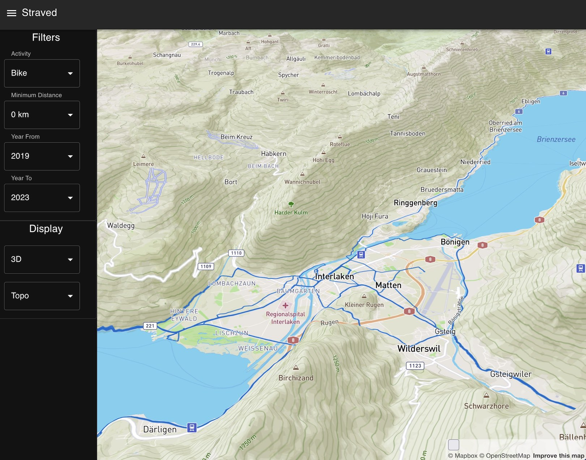
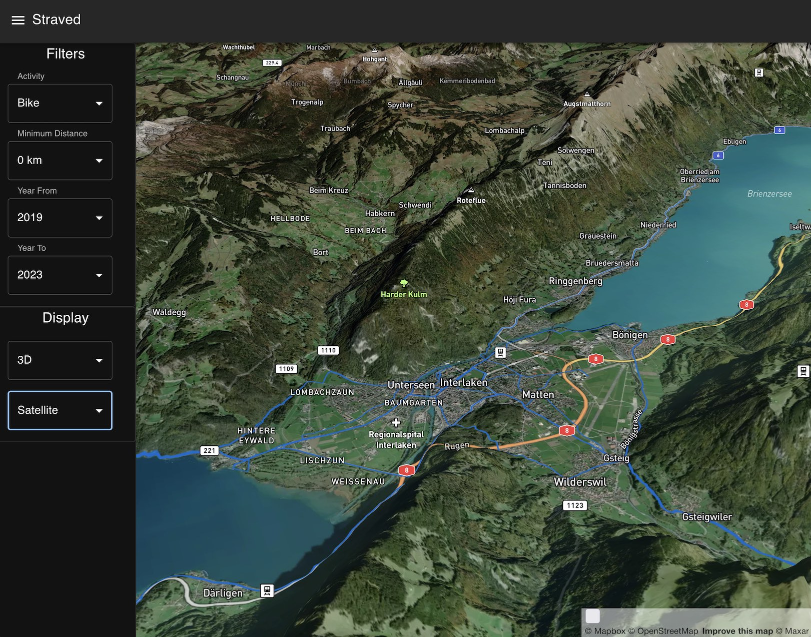

# Stravad


_Easily visualize and explore your strava activities in glorious vectorized 3D_

<table>
  <tr>
    <td>Topo map</td>
     <td>Satellite map</td>
  </tr>
  <tr>
    <td></td>
    <td></td>
  </tr>
 </table>


## What is it?

Stravad periodically fetches your activities from Strava so you can work with the data locally, and easily visualize
it in with the included interactive 3D map webapp. From the app, you can quickly filter activities by year, type, and so on,
and click on individual activities to be taken to the strava page for them, making it easy to find old routes.

Activities are made available as: 

* GeoJSON
* Raw strava JSON, with all the extra bits and bobs
* A mbtiles vector tileset 

Stravad is made up of two components:

* A ruby application that uses the Strava API to download your strava data and convert it to vector tiles
* A react frontend application, using the [mapbox-gl-js](https://github.com/mapbox/mapbox-gl-js) library 
to provide interactive exploration of your data

These are packaged up for ease-of-use into docker containers, and can be run anywhere docker runs. Scripts
are included to run the components directly with docker, and a Kubernetes manifest is provided for a more
complete alternative.

## Requirements

### 1. Mapbox Account
You need a Mapbox API key to use MapboxJS, and we use the Mapbox servers to retrieve our base tilesets - 
satellite imagery, roads, points-of-interest, and so on.

[Sign up](https://account.mapbox.com/auth/signup/) for a Mapbox account, and note down your public access key.

### 2. Strava Developer Account
You need API credentials to access your strava account to scrape your activity data.

From your strava account, jump to the [API management page](https://www.strava.com/settings/api). Note down
your Client ID and refresh token - you'll need them later.


## Getting Started 

``` bash
# Make Mapbox API key available for the react build
cat > frontend/.env << EOF
REACT_APP_MAPBOX_API_TOKEN=pk.aabbccdd
EOF 

# Create a secret for the mapbox credentials
kubectl -n stravad create secret generic mapbox-credentials --from-env-file=frontend/.env

# Create an `env.sh` in `fetch` to specify strava access credentials:
cat > fetch/env.sh << EOF
STRAVA_CLIENT_ID="2345
STRAVA_CLIENT_SECRET="00aabbccddee"
STRAVA_REFRESH_TOKEN="eeffaabbccdd"
EOF

# Create the namespace
kubectl create namespace stravad

# Create a secret containing the environment variables we need
kubectl -n stravad create secret generic strava-credentials --from-env-file=fetch/env.sh

# Apply the manifest
kubectl apply -f deploy/manifest.yaml
```

Once everything's up and running, we can manually trigger the scraping job, rather than waiting
until the daily cron trigger fires:

```bash
kubectl create job --from=cronjob/stravad-scrape runnow -n stravad
```

